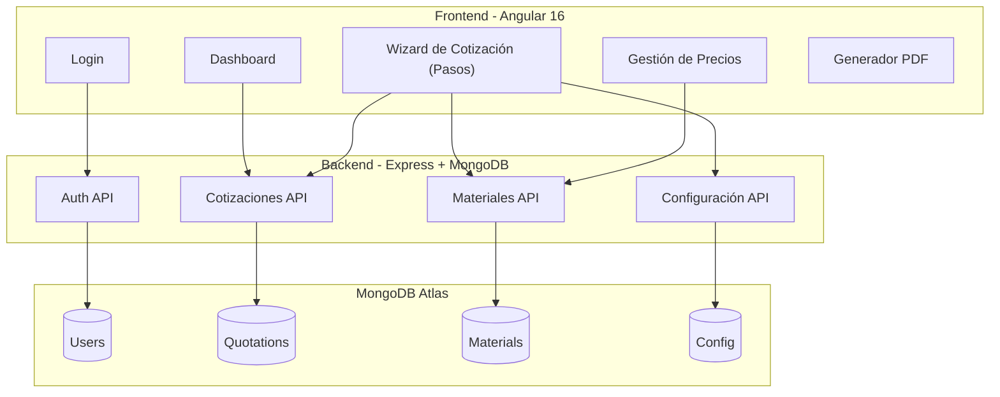

# Sistema de Cotizaciones Spazio Vitale — Plan de Implementación

## Contexto

Spazio Vitale actualmente genera cotizaciones de mobiliario de forma manual usando archivos Excel. El flujo involucra:
1. Llenar datos del cliente en una plantilla de cotización
2. Recibir un presupuesto por mueble del diseñador
3. Auditar y ajustar precios consultando listas de precios de proveedores
4. Calcular costos en 7 secciones por mueble (insumos, cantos, accesorios, diseño, cortes, armado, instalación)
5. Aplicar márgenes (imprevistos, utilidad, indirectos, IVA, descuento)
6. Generar el documento final de cotización para el cliente

**Objetivo**: Reemplazar completamente los archivos Excel con una aplicación web que automatice todo el flujo, aplique las fórmulas y cálculos desde la lógica, y genere el documento final de cotización.

---

## User Review Required

> [!IMPORTANT]
> **Backend desplegado en Render**: Actualmente el backend está en `https://csvbkn.onrender.com`. Todos los nuevos modelos y endpoints se agregarán al mismo proyecto Node.js/Express/MongoDB existente en la carpeta `csvbkn/`. ¿Es correcto o prefieres un backend separado?

> [!IMPORTANT]
> **Generación de PDF**: El documento final de cotización se generará como PDF descargable desde el frontend. Se usará la librería `jsPDF` + `jspdf-autotable` directamente en Angular para generar el PDF en el cliente, replicando el formato visual de tu cotización actual (encabezado azul, tablas con bordes, logo, datos del cliente, condiciones de pago). ¿Estás de acuerdo o prefieres que el PDF se genere desde el backend?

> [!WARNING]
> **Número de cotización (No.)**: Actualmente los números de cotización se asignan manualmente (ej. No.2604, No.2621). El sistema los generará automáticamente de forma secuencial. ¿Deseas un consecutivo automático, o necesitas poder editarlo manualmente?

---

## Open Questions

> [!IMPORTANT]
> **1. Listas de precios de proveedores**: En tu flujo actual, consultas precios de melaminas en la hoja "TIEMPOS M.O PRODUCCIÓN – HOJA MELAMINAS" y el valor hora de "HORAS PROVISIONALES". ¿Deseas que la aplicación tenga un módulo de **gestión de listas de precios** donde puedas cargar y actualizar estos valores? ¿O prefieres que los precios se ingresen manualmente en cada cotización?

> [!IMPORTANT]
> **2. Roles de usuario**: ¿Necesitas diferenciar entre un rol de "diseñador" (que crea el presupuesto inicial) y un rol de "auditor/administrador" (que revisa, ajusta precios y aprueba)? ¿O solo habrá un tipo de usuario que hace todo?

> [!IMPORTANT]
> **3. Porcentajes configurables**: Los porcentajes actuales son: Imprevistos 10%, Utilidad 35%, Indirectos 32%, IVA 19%, Descuento 10%. ¿Estos valores son fijos para todas las cotizaciones, o necesitas poder cambiarlos por cotización?

> [!IMPORTANT]
> **4. Mesones (Quarztone, etc.)**: En la cotización final hay secciones separadas como "MESON QUARZTONE BLANCO POLAR" con items como cortes y brillado (CORBRI). ¿Estos mesones se presupuestan de forma diferente a los muebles (las 7 secciones), o son un tipo especial de mueble?

---

## Arquitectura General



---

## Proposed Changes

### Componente 1: Modelo de Datos (Backend - MongoDB)

Nuevos modelos Mongoose para almacenar toda la información de cotizaciones, materiales y configuración.

---

#### [NEW] [Material.js](file:///c:/Users/USUARIO/Desktop/8.%20Cotizador%20SV/csvbkn/models/Material.js)

Modelo unificado para materiales/insumos con categorías. Reemplaza las hojas de Excel de listas de precios.

```javascript
// Categorías: 'melamina', 'canto', 'accesorio', 'herraje', 'vidrio', 'otro'
{
  category: String,       // Categoría del material
  code: String,           // Código del proveedor (ej. "CDA2798", "TFC600A")
  description: String,    // Descripción completa
  provider: String,       // Proveedor
  color: String,          // Color (si aplica)
  dimension: String,      // Dimensión (ej. "244 x 183", "1.22 x 2.44")
  unit: String,           // Unidad de medida: LAMINA, ML, UNIDAD, SERVICIO, KIT, TIROS
  unitPrice: Number,      // Precio unitario
  // Para melaminas:
  pricePerSheet: Number,  // Precio por lámina
  measure1: Number,       // Medida 1 (ancho)
  measure2: Number,       // Medida 2 (alto)
  sqmPerSheet: Number,    // M2 por lámina (calculado)
  pricePerSqm: Number,    // Precio por M2 (calculado)
  active: Boolean,
  updatedAt: Date
}
```

#### [NEW] [Config.js](file:///c:/Users/USUARIO/Desktop/8.%20Cotizador%20SV/csvbkn/models/Config.js)

Configuración global del sistema (valor hora, porcentajes, número consecutivo).

```javascript
{
  laborRatePerHour: Number,    // Valor hora mano de obra (ej. $12,495)
  designRatePerHour: Number,   // Valor hora diseñador (ej. $16,780)
  unforeseenPercent: Number,   // % Imprevistos (10)
  profitPercent: Number,       // % Utilidad (35)
  indirectPercent: Number,     // % Indirectos (32)
  taxPercent: Number,          // % IVA (19)
  defaultDiscount: Number,     // % Descuento por defecto (10)
  nextQuotationNumber: Number, // Consecutivo siguiente
  wasteTable: [{               // Tabla de desperdicios para cantos
    minMl: Number,             // Rango mínimo en ML
    maxMl: Number,             // Rango máximo en ML
    factor: Number             // Factor de desperdicio
  }],
  paymentTerms: String,        // Condiciones de pago por defecto
  validityDays: Number         // Días de validez de la oferta
}
```

#### [NEW] [Quotation.js](file:///c:/Users/USUARIO/Desktop/8.%20Cotizador%20SV/csvbkn/models/Quotation.js)

Modelo principal de cotización. Documento embebido con toda la estructura jerárquica.

```javascript
{
  number: Number,               // No. Cotización (auto-increment)
  date: Date,
  city: String,                 // "San Juan de Pasto"
  
  // Datos del cliente
  client: {
    name: String,
    city: String,
    phone: String,
    email: String
  },
  
  // Título general
  title: String,                // "VENTA, ELABORACIÓN E INSTALACIÓN DE MOBILIARIO"
  
  // Áreas (COCINA, BAÑO, SALA, etc.)
  areas: [{
    name: String,               // "COCINA", "CENTRO DE ENTRETENIMIENTO"
    
    // Muebles dentro del área
    furniture: [{
      name: String,             // "COCINA INTEGRAL", "MUEBLE 1"
      description: String,
      measurements: String,     // "VARIAS", "210 X 208"
      quantity: Number,
      unit: String,             // "SERVICIO", "M2"
      
      // === 7 SECCIONES DE PRESUPUESTO ===
      
      // 1. INSUMOS (TABLEROS - MELAMINAS - FORMICAS)
      supplies: [{
        item: Number,
        description: String,    // "MELAMINA RH DE 15 MM TARDA"
        providerColor: String,
        dimension: String,      // "244 x 183"
        unitOfMeasure: String,  // "LAMINA"
        quantity: Number,
        total: Number,          // Calculado
        unitPrice: Number,
        totalPrice: Number      // Calculado: total * unitPrice
      }],
      
      // 2. INSUMOS (CANTOS)
      edgeBands: [{
        item: Number,
        description: String,    // "CANTO FLEX DE 19 MM X 0.45 TARDA"
        color: String,
        unitOfMeasure: String,  // "ML"
        quantity: Number,       // ML ingresados
        wasteFactor: Number,    // Del rango (0.5, 0.35, 0.3, 0.25)
        waste: Number,          // Calculado: quantity * wasteFactor
        total: Number,          // Calculado: quantity + waste
        unitPrice: Number,
        totalPrice: Number      // Calculado: total * unitPrice
      }],
      
      // 3. MANO DE OBRA ACCESORIOS - VIDRIOS - ESPEJOS - HERRAJES
      accessories: [{
        item: Number,
        description: String,
        dimension: String,
        quantity: Number,
        timeHours: Number,      // Horas de M.O.
        totalTime: Number,      // Calculado: quantity * timeHours
        laborRate: Number,      // Valor hora
        totalPrice: Number      // Calculado: totalTime * laborRate
      }],
      
      // 4. TIEMPOS DE ASESORÍA Y DISEÑO
      designTime: [{
        description: String,    // "DISEÑO Y ASESORÍA", "DESPIECE", etc.
        quantity: Number,       // Horas
        laborRate: Number,      // Valor hora diseñador
        totalPrice: Number      // Calculado
      }],
      clientPaidDesign: Boolean, // Si el cliente ya pagó diseño ($0)
      
      // 5. CORTES MELAMINAS Y FÓRMICA
      cuts: [{
        description: String,    // "CORTE DE MELAMINAS", "ENCHAPE", etc.
        sqm: Number,            // M2
        timeHours: Number,
        quantity: Number,
        laborRate: Number,
        totalPrice: Number      // Calculado
      }],
      
      // 6. MANO DE OBRA ARMADO
      assembly: [{
        description: String,    // Nombre del mueble
        measurement: String,    // Medida
        unitOfMeasure: String,  // m2, ml, uni
        assemblyHours: Number,  // #ARMADO
        persons: Number,        // Personas
        totalQuantity: Number,  // Calculado
        laborRate: Number,
        totalPrice: Number      // Calculado
      }],
      
      // 7. INSTALACIÓN CON 2 PERSONAS EN OBRA
      installation: [{
        description: String,
        measurement: String,
        unitOfMeasure: String,
        installHours: Number,   // #INSTALANDO
        persons: Number,        // 2 por defecto
        totalQuantity: Number,  // Calculado
        laborRate: Number,
        totalPrice: Number      // Calculado
      }],
      
      // Totales por mueble (calculados)
      totalCost: Number,        // Suma de las 7 secciones
      totalBudget: Number       // Valor final del mueble para cotización
    }],
    
    // Accesorios/Herrajes visibles en cotización (para la tabla del cliente)
    visibleAccessories: [{
      description: String,
      measurements: String,
      quantity: Number,
      unit: String
    }],
    
    // Sub-áreas (ej. "MESON QUARZTONE BLANCO POLAR")
    subAreas: [{
      name: String,
      items: [{
        description: String,
        measurements: String,
        quantity: Number,
        unit: String,           // "ML", "SER"
        price: Number
      }],
      total: Number
    }],
    
    areaTotal: Number           // Calculado: sum de furniture + subAreas
  }],
  
  // Cálculos finales
  totals: {
    totalCost: Number,            // Suma de todos los muebles
    unforeseenPercent: Number,    // 10%
    unforeseenAmount: Number,
    profitPercent: Number,        // 35%
    profitAmount: Number,
    indirectPercent: Number,      // 32%
    indirectAmount: Number,
    subtotal: Number,             // totalCost + imprevistos + utilidad + indirectos
    taxPercent: Number,           // 19%
    taxAmount: Number,
    totalWithTax: Number,
    discountPercent: Number,      // Variable
    discountAmount: Number,
    grandTotal: Number,           // TOTAL FINAL
    totalSqm: Number,            // M2 totales
    pricePerSqm: Number          // Precio por M2
  },
  
  // Metadata
  status: String,                 // 'borrador', 'auditada', 'enviada', 'aprobada'
  paymentTerms: String,
  validityDays: Number,
  notes: String,
  createdBy: ObjectId,            // ref: User
  createdAt: Date,
  updatedAt: Date
}
```

---

### Componente 2: API Backend (Endpoints)

#### [MODIFY] [index.js](file:///c:/Users/USUARIO/Desktop/8.%20Cotizador%20SV/csvbkn/index.js)

Se refactorizará en archivos de rutas separados. Se agregará middleware de autenticación JWT.

#### [NEW] csvbkn/middleware/auth.js

Middleware que valida el token JWT en cada petición protegida.

#### [NEW] csvbkn/routes/quotations.js

| Método | Ruta | Descripción |
|--------|------|-------------|
| `GET` | `/api/quotations` | Listar cotizaciones (con filtros, paginación) |
| `GET` | `/api/quotations/:id` | Obtener cotización completa |
| `POST` | `/api/quotations` | Crear nueva cotización |
| `PUT` | `/api/quotations/:id` | Actualizar cotización |
| `DELETE` | `/api/quotations/:id` | Eliminar cotización |
| `POST` | `/api/quotations/:id/duplicate` | Duplicar cotización |
| `PATCH` | `/api/quotations/:id/status` | Cambiar estado |

#### [NEW] csvbkn/routes/materials.js

| Método | Ruta | Descripción |
|--------|------|-------------|
| `GET` | `/api/materials` | Listar materiales (por categoría) |
| `POST` | `/api/materials` | Crear material |
| `PUT` | `/api/materials/:id` | Actualizar precio/datos |
| `DELETE` | `/api/materials/:id` | Eliminar material |
| `POST` | `/api/materials/bulk` | Carga masiva de materiales |

#### [NEW] csvbkn/routes/config.js

| Método | Ruta | Descripción |
|--------|------|-------------|
| `GET` | `/api/config` | Obtener configuración actual |
| `PUT` | `/api/config` | Actualizar configuración |

---

### Componente 3: Frontend Angular — Estructura de Módulos y Páginas

```
src/app/
├── guards/
│   └── auth.guard.ts                    (existe)
├── services/
│   ├── auth.service.ts                  (existe)
│   ├── theme.service.ts                 (existe)
│   ├── quotation.service.ts             [NEW] CRUD cotizaciones
│   ├── material.service.ts              [NEW] CRUD materiales
│   └── config.service.ts               [NEW] Configuración global
├── interceptors/
│   └── auth.interceptor.ts             [NEW] Agrega token JWT a todas las peticiones
├── models/
│   ├── quotation.model.ts              [NEW] Interfaces TypeScript
│   ├── material.model.ts               [NEW]
│   └── config.model.ts                 [NEW]
├── pages/
│   ├── login/                           (existe)
│   ├── dashboard/                       [MODIFY] Panel principal con estadísticas
│   ├── quotation-list/                  [NEW] Lista de cotizaciones
│   ├── quotation-wizard/                [NEW] Wizard paso a paso
│   │   ├── step-client/                 [NEW] Paso 1: Datos del cliente
│   │   ├── step-areas/                  [NEW] Paso 2: Áreas y muebles
│   │   ├── step-budget/                 [NEW] Paso 3: Presupuesto (7 secciones)
│   │   ├── step-review/                 [NEW] Paso 4: Auditoría y totales
│   │   └── step-generate/              [NEW] Paso 5: Generar documento PDF
│   ├── price-list/                      [NEW] Gestión de listas de precios
│   └── settings/                        [NEW] Configuración del sistema
└── components/
    ├── sidebar/                         [NEW] Menú lateral de navegación
    ├── header/                          [NEW] Barra superior con usuario y tema
    └── budget-section/                  [NEW] Componente reutilizable para cada sección
```

---

### Componente 4: Dashboard Principal

#### [MODIFY] [dashboard.component.ts](file:///c:/Users/USUARIO/Desktop/8.%20Cotizador%20SV/cotizadorspaziovitale/src/app/pages/dashboard/dashboard.component.ts)
#### [MODIFY] [dashboard.component.html](file:///c:/Users/USUARIO/Desktop/8.%20Cotizador%20SV/cotizadorspaziovitale/src/app/pages/dashboard/dashboard.component.html)

Rediseño completo con layout de aplicación (sidebar + contenido):

- **Sidebar**: Navegación a Cotizaciones, Listas de precios, Configuración, Cerrar sesión
- **Área principal**: Tarjetas con estadísticas (cotizaciones del mes, monto total, pendientes por auditar)
- **Lista rápida**: Últimas cotizaciones con estado (borrador, auditada, enviada)
- **Acceso directo**: Botón "Nueva Cotización" prominente

---

### Componente 5: Wizard de Cotización (Flujo paso a paso)

Este es el componente central de la aplicación. Replica y automatiza todo el flujo que hoy se hace en Excel.

#### Paso 1: Datos del Cliente
- Formulario: Ciudad, Fecha, Nombre del cliente, Ciudad del cliente, Teléfono, Email
- Título general (con valor por defecto: "VENTA, ELABORACIÓN E INSTALACIÓN DE MOBILIARIO")
- Número de cotización auto-asignado

#### Paso 2: Áreas y Muebles
- Crear áreas (COCINA, BAÑO, CENTRO DE ENTRETENIMIENTO, etc.)
- Dentro de cada área, agregar muebles con: nombre, medidas, cantidad, unidad
- Agregar sub-áreas opcionales (ej. MESON QUARZTONE)
- Interfaz drag & drop para reordenar

#### Paso 3: Presupuesto por Mueble (7 Secciones)
Para cada mueble definido en el paso anterior, completar las 7 secciones:

| # | Sección | Cálculo Automatizado |
|---|---------|---------------------|
| 1 | **Insumos (Tableros/Melaminas/Fórmicas)** | Búsqueda en lista de precios → precio unitario × cantidad = total |
| 2 | **Insumos (Cantos)** | Cantidad ML + factor de desperdicio automático por rango (1-10: ×0.5, 11-30: ×0.35, 31-50: ×0.3, 50-100: ×0.25) = total ML × precio |
| 3 | **Accesorios/Herrajes** | Cantidad × horas M.O. × valor hora = total |
| 4 | **Asesoría y Diseño** | Cantidad horas × valor hora diseñador. Si cliente pagó diseño → $0 |
| 5 | **Cortes Melaminas y Fórmica** | M2 × tiempo × cantidad × valor hora |
| 6 | **Mano de Obra Armado** | Medida × #armado × personas × valor hora |
| 7 | **Instalación (2 personas)** | Medida × #instalando × personas × valor hora |

- Búsqueda inteligente de materiales al escribir (autocomplete desde la lista de precios)
- Cálculos en tiempo real al modificar cualquier campo
- Indicadores visuales de subtotales por sección

#### Paso 4: Auditoría y Resumen
- Vista consolidada de todos los costos
- Cálculo automático:

```
TOTAL COSTO          = Σ (7 secciones de todos los muebles)
IMPREVISTOS          = TOTAL COSTO × 10%
UTILIDAD             = TOTAL COSTO × 35%
INDIRECTOS           = TOTAL COSTO × 32%
─────────────────────────────────────────
TOTAL                = TOTAL COSTO + IMPREVISTOS + UTILIDAD + INDIRECTOS
IVA                  = TOTAL × 19%
TOTAL CON IVA        = TOTAL + IVA
DESCUENTO            = TOTAL CON IVA × 10%
─────────────────────────────────────────
TOTAL FINAL          = TOTAL CON IVA - DESCUENTO

M2 TOTALES           = Σ M2 de todos los muebles
PRECIO POR M2        = TOTAL FINAL ÷ M2 TOTALES
```

- Posibilidad de ajustar porcentajes individualmente por cotización
- Alertas de auditoría si hay precios inusuales o campos vacíos

#### Paso 5: Generar Documento
- Vista previa del documento final con el formato de cotización de Spazio Vitale
- Generación de PDF descargable replicando el diseño actual:
  - Encabezado con logo, fecha, datos del cliente, No. de cotización
  - Tablas por área con muebles, accesorios y sub-áreas
  - Totales por área y total general
  - Condiciones de pago, validez de la oferta, firma
- Opciones: Descargar PDF, Guardar como borrador, Marcar como enviada

---

### Componente 6: Gestión de Listas de Precios

#### [NEW] pages/price-list/

- Vista tabular editable de materiales por categoría (tabs: Melaminas, Cantos, Accesorios, Herrajes)
- CRUD inline (editar precios directamente en la tabla)
- Búsqueda y filtrado por proveedor, código, descripción
- Indicador de "última actualización" por material
- Carga masiva desde CSV/Excel (opcional en fase posterior)

---

### Componente 7: Configuración del Sistema

#### [NEW] pages/settings/

- Valor hora de producción
- Valor hora de diseñador
- Porcentajes por defecto (imprevistos, utilidad, indirectos, IVA, descuento)
- Tabla de desperdicios para cantos (rangos y factores)
- Condiciones de pago por defecto
- Días de validez de oferta por defecto

---

### Componente 8: Interceptor HTTP + Layout

#### [NEW] interceptors/auth.interceptor.ts

Intercepta todas las peticiones HTTP y agrega automáticamente el header `Authorization: Bearer <token>`.

#### [NEW] components/sidebar/

Menú lateral de navegación persistente en todas las páginas post-login. Ítems:
- 🏠 Dashboard
- 📄 Cotizaciones
- 💰 Lista de Precios
- ⚙️ Configuración
- 🚪 Cerrar Sesión

#### [NEW] components/header/

Barra superior con: nombre del usuario, toggle de tema claro/oscuro (reutiliza ThemeService existente).

---

## Fases de Implementación

### Fase 1: Infraestructura (Backend + Layout)
1. Modelos MongoDB (Material, Config, Quotation)
2. Middleware de autenticación JWT
3. Rutas del backend (materials, config, quotations)
4. Interceptor HTTP en el frontend
5. Layout con Sidebar + Header
6. Rutas protegidas con AuthGuard

### Fase 2: Gestión de Datos Base
1. Página de Configuración (valores hora, porcentajes, tabla desperdicios)
2. Página de Lista de Precios (CRUD de materiales)
3. Dashboard con estadísticas básicas

### Fase 3: Wizard de Cotización
1. Paso 1: Formulario de datos del cliente
2. Paso 2: Gestión de áreas y muebles
3. Paso 3: Presupuesto con las 7 secciones y cálculos automáticos
4. Paso 4: Auditoría y totales
5. Paso 5: Vista previa y generación de PDF

### Fase 4: Pulido y Funcionalidades Extras
1. Lista de cotizaciones con filtros y búsqueda
2. Duplicar cotización
3. Estados de cotización (borrador → auditada → enviada → aprobada)
4. Responsive design mobile

---

## Verification Plan

### Automated Tests
- Ejecutar `ng build` para verificar que el frontend compila sin errores
- Probar manualmente los endpoints del backend con la consola del navegador o Postman
- Validar los cálculos de presupuesto contra ejemplos reales de cotizaciones de Excel

### Manual Verification
- Crear una cotización de prueba replicando la **Cotización No.2604** (COCINA) de la imagen proporcionada
- Verificar que los totales calculados por la aplicación coincidan con los del Excel original
- Verificar que el PDF generado replica el formato visual de la cotización actual
- Probar el flujo completo: login → dashboard → nueva cotización → completar wizard → generar PDF
